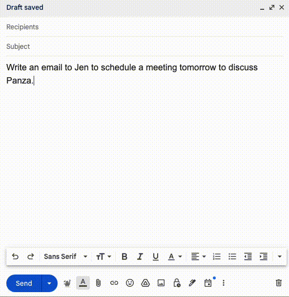

<div align="center">
  
</div>

#  Panza: A personal email assistant, trained and running on-device


<a target="_blank" href="https://lightning.ai/maddox-j/studios/panzamail-demo">
  
</a>


##  What is Panza?


Panza is an automated email assistant customized to your writing style and past email history. \
Its main features are as follows: 
* Panza produces a fine-tuned LLM that matches your writing style, pairing it with a Retrieval-Augmented Generation (RAG) component which helps it produce relevant emails.
* Panza **can be trained and run entirely locally**. Currently, it requires a single GPU with
16-24 GiB of memory, but we also plan to release a CPU-only version. **At no point in training or execution is your data shared with the entities that trained the original LLMs, with LLM distribution services such as Huggingface, or with us.**
* Training and execution are also quick - for a dataset on the order of 1000 emails, training Panza takes well under an hour, and generating a new email takes a few seconds at most.

<div align="center">
  
</div>


## Prerequisites
- Your emails, exported to `mbox` format (see tutorial below).
- A computer, preferably with a NVIDIA GPU with at least 24 GiB of memory (alternatively, check out [running in Google Colab](#cloud-try-out-panza-in-google-colab)).
- A Hugging Face [account](https://huggingface.co/login) to download the models (free of charge).
- [Optional] A Weights & Biases [account](https://wandb.ai/login) to log metrics during training (free of charge).
- Basic Python and Unix knowledge, such as building environments and running python scripts.
- *No prior LLMs experience is needed*.


## How it works

### :film_projector: Step 1: Data playback

For most email clients, it is possible to download a user's past emails in a machine-friendly .mbox format. For example, GMail allows you to do this via [Google Takeout](https://takeout.google.com), whereas Thunderbird allows one to do this via various plugins. 

One key part of Panza is a dataset-generation technique we call **data playback**:  Given some of your past emails in .mbox format, we automatically create a training set for Panza by using a pretrained LLM to summarize the emails in instruction form; each email becomes a `(synthetic instruction, real email)` pair.
Given a dataset consisting of all pairs, we use these pairs to "play back" your sent emails: the LLM receives only the instruction, and has to generate the "ground truth" email as a training target.

We find that this approach is very useful for the LLM to "learn" the user's writing style.


### :weight_lifting: Step 2: Local Fine-Tuning via Robust Adaptation (RoSA)

We then use parameter-efficient finetuning to train the LLM on this dataset, locally. We found that we get the best results with the [RoSA method](https://arxiv.org/pdf/2401.04679.pdf), which combines low-rank (LoRA) and sparse finetuning. If parameter efficiency is not a concern, that is, you have a more powerful GPU, then regular, full-rank/full-parameter finetuning can also be used. We find that a moderate amount of further training strikes the right balance between matching the writer's style without memorizing irrelevant details in past emails.


### :owl:	Step 3: Serving via RAG

Once we have a custom user model, Panza can be run locally together with a Retrieval-Augmented Generation (RAG) module. Specifically, this functionality stores past emails in a database and provides a few relevant emails as context for each new query. This allows Panza to better insert specific details, such as a writer's contact information or frequently used Zoom links.

The overall structure of Panza is as follows: 
<div align="center">
  
</div>

## Installation

### Environment.
We tested Panza using python 3.10. If you are running a different version, you can either install it directly or, for instance, using [miniconda](https://docs.anaconda.com/free/miniconda/miniconda-install/):
```bash
conda create -n panza python=3.10 -y
conda activate panza
```
Then, Install the required packages:
``` bash
pip install .
```
If you want to also finetune models using Panza, you will need to install additional packages:
``` bash
pip install .[training]
```

## :rocket: Getting started

To quickly get started with building your own personalized email assistant, follow the steps bellow:

<!-- To train your personalized email assistant, follow the three steps below. -->

<!-- TODO: Replace steps with #### heading? -->
### Step 0: Download your sent emails
<!-- **Step 1: Download your sent emails** -->
<details>
  <summary> Expand for detailed download instructions.</summary>

  We provide a description for doing this for GMail via Google Takeout.

  1. Go to [https://takeout.google.com/](https://takeout.google.com/).
  2. Click `Deselect all`.
  3. Find `Mail` section (search for the phrase `Messages and attachments in your Gmail account in MBOX format`).
  4. Select it.
  5. Click on `All Mail data included` and deselect everything except `Sent`.
  6. Scroll to the bottom of the page and click `Next step`.
  7. Click on `Create export`.
  8. Wait for download link to arrive in your inbox.
  9. Download `Sent.mbox` and place it in the `data/` directory.

  For Outlook accounts, we suggest doing this via a Thunderbird plugin for exporting a subset of your email as an MBOX format, such as [this add-on](https://addons.thunderbird.net/en-us/thunderbird/addon/importexporttools-ng/).
</details>

At the end of this step you should have the downloaded emails placed inside `data/Sent.mbox`.

<!-- **Step 0: Environment configuration** -->

### Step 1: Environment configuration

<!-- 🎛️ -->
Panza is configured through a set of yaml configurations defined in `configs/`. There is a single high-level config under `configs/base.yaml`, and the rest are organized under the main functionalities of the code.
Note that these task-specific configs can, in some cases, be used to override base configs.
 Specific use cases, such as hyperparameter tuning, are covered in more detail in `scripts/README.md`.

1. Data preparation: `configs/data_preparation.yaml`. Additionally, a custom user config must be created under `config/users/` (see below).
1. Finetuning: the main config is in `configs/panza_finetuning.yaml` and the method-specific ones are in `configs/finetuning/`
1. Serving: Serving consists of two parts - a serving infrastructure (that we call 'writer') that runs the LLM and so converts prompts to Panza outputs, and an `interface`, which presents the outputs in a useful form - through a command-line interface, a web interface, a gmail client, or in a bulk `.json` format (useful for evaluation). The configs for serving are in `panza_writer.yaml`, and for the interfaces, under `configs/interfaces`.

<!-- 💬 -->
These scripts are described in more detail in `scripts/README.md`, but a few customizations need to happen immediately.
:warning: Before continuing, make sure you complete the following setup:
- Perform the following modifications on `users/default.yaml` directly. If running Panza for multiple users, copy this file to, for example, `users/jen.yaml` and specify the user in Panza training commands.
- In the user config, set the email address and username. The email address should be the sender address in the exported emails. (Panza uses this to edit out responses and other emails sent by a different author in the `.mbox` dump.). The username does not have to link to the email itself - it is simply used as a name for the various data files that will come out of the data preparation process. A handy way to set this is if you set it to be the output of the `whoami` call in your shell.
- Modify the personal prompt in `prompt_preambles/user_preamble.txt` to include some basic information about yourself that Panza can use to customize your emails with your correct full name, address, phone number, etc.
  

Additionally, please perform the following login steps to be able to download the base model. 
  - Login to Hugging Face to be able to download pretrained models: `huggingface-cli login`.
  - [Optional] Login to Weights & Biases to log metrics during training: `wandb login`. Then, set `wandb_disabled=false` in `configs/finetuning/base.yaml`.


You are now ready to move to `scripts`.
``` bash
cd scripts
```

### Step 2: Extract emails
<!-- **Step 2: Extract emails** -->

Run `CUDA_VISIBLE_DEVICES=X ./prepare_data.sh`.<details>
    <summary> This scripts takes care of all the prerequisites before training (expand for details). </summary>

    - Extracts your emails in text format to `data/<username>_clean.jsonl` which you can manually inspect.
    - Creates synthetic prompts for your emails as described in the [data playback](#film_projector-step-1-data-playback) section. The results are stored in `data/<username>_clean_summarized.jsonl` and you can inspect the `"summary"` field.
    - Splits data into training and test subsets. See `data/train.jsonl` and `data/test.jsonl`.
    - Creates a vector database from the embeddings of the training emails which will later be used for *Retrieval-Augmented Generation (RAG)*. See `data/<username>.pkl` and `data/<username>.faiss`.
</details>

**NB**: if you did not change the default configuration in `user/default.yaml` to reflect your particulars but rather created a new file, you need to add the additional flag to the above command where you specify `user=x` where your config file was named `x.yaml`.

<details>
    <summary> FAQs. </summary>
    When running the above script, you may encounter an <code>OutOfMemoryError</code>. If this is the case, you can either:
    <ol>
      <li> Reduce the batch size for the data processing step. This can be found in <code>configs/panza_preparation.yaml</code>.
      <li> Move to a machine that has more memory.
    </ol>
  </details>


### Step 3: Train a LLM on your emails
<!-- **Step 3: Train a LLM on your emails** -->

We currently support `LLaMA3-8B-Instruct` and `Mistral-Instruct-v0.2` LLMs as base models; the former is the default, but we obtained good results with either model.   

1. [Recommended] For parameter efficient fine-tuning, run `./train_rosa.sh`.  
If a larger GPU is available and full-parameter fine-tuning is possible, run `./train_fft.sh`.

2. We have prepopulated the training configs with parameter values that worked best for us. We recommend you try those first, but you can also experiment with different hyper-parameters by passing extra arguments to the training script, such as `lr`, `lora_lr`, `num_epochs`. All the trained models are saved in the `checkpoints` directory.

Examples:
``` bash
CUDA_VISIBLE_DEVICES=X ./train_rosa.sh                                   # Will use the default parameters.

CUDA_VISIBLE_DEVICES=X ./train_rosa.sh finetuning.lr=1e-6 finetuning.rosa_lr=1e-6 finetuning.max_duration=7ep
```

On a smaller GPU, it may be necessary to further train in lower precision (QRoSA). This can be run as follows:

``` bash
./train_rosa.sh finetuning.precision=amp_bf16 finetuning.model.weight_bias_dtype=4bit
```

<details>
    <summary> FAQs. </summary>
    The bash scripts that are used to execute the finetuning procedure assume by default that your username is what is returned by the <code>whoami</code> command. This is used to locate the name of the user configs inside the <code>configs/user</code> directory as above. If you directly modified <code>default.yaml</code>, or created another yaml file where the name of that file does not match with the output of <code>whoami</code>, there will be an error. This is an easy fix. You can either:
    <ol>
      <li> Change the name of the yaml file to be the output of <code>whoami</code>.
      <li> You can override the username manually when you launch the bash script by adding <code>user=x</code> where <code>x</code> is the name of the yaml file you created. For example: <code>./train_rosa.sh user=alonso</code>
    </ol>
  <br>
  If you wish to add <code>CUDA_VISIBLE_DEVICES</code> to specify a specific GPU, please add this in the shell script directly by <code>export CUDA_VISIBLE_DEVICES=x</code> where <code>x</code> is the ID of the GPU you wish to use.
  <br><br>
  A known issue is that when you fine-tune your model with RAG, there can be a case when the tokenization of the dataset seemingly hangs. This is due to a known bug with with HF's <code>map</code> function where <code>n_proc>1</code>. To alleviate this issue, you can set <code>torch.set_num_threads(1)</code> in <code>src/panza/finetuning/train.py</code> or set the equivalent parameter in <code>configs/finetuning/rosa.yaml</code>.
  </details>


### Step 5: Launch Panza!
<!-- **Step 5: Launch Panza!** -->

- To run Panza after a full training run, run a command like `CUDA_VISIBLE_DEVICES=0 ./runner.sh user=USERNAME interfaces=cli writer/llm=transformers checkpoint=latest`.
- To run Panza after a RoSA or LoRA training run, replace `writer/llm=transformers` with `writer/llm=peft`

### :new: Use Panza in Google Chrome directly with your Gmail!
In addition to the Panza package itself, we have also created a tool that will allow you to use Panza directly within your Gmail session. We have published
this extension on [Google Chrome here](https://chromewebstore.google.com/detail/panzaextension/njmkmdbgneiaoahngollkmejoinnaicm?authuser=4&hl=en). Here is a written guide on how to get this setup below.
* Launch the Panza web server: Instead of using the cli as an interface above, we execute the following command: `CUDA_VISIBLE_DEVICES=0 API_KEYS=panza_beta ./runner.sh user=USERNAME interfaces=web writer/llm=peft checkpoint=latest`.
  1. We have to choose an API key that the server will use. Since the browser extension we have created is a beta release, the API_KEY by default is `panza_beta`.
  2. Executing this script spins up a web server on port 5001 by default. The port can be changed in the `configs/interfaces/web.json` file. However, our browser extension sends API requests to `localhost:5001` only in this beta version.
* [Optionally add port forwarding] If you are not running the Panza web server on the same device where Google Chrome is installed, you will be unable to make requests to a server with a reference to `localhost`. To correctly use the server, you will have to enable port forwarding from the remote machine to your local device. This is done by VSCode automatically if you are SSH'ed into a remote server, and spin up Panza there.
* Install the [Google Chrome extension here](https://chromewebstore.google.com/detail/panzaextension/njmkmdbgneiaoahngollkmejoinnaicm?authuser=4&hl=en).
Now we that we have setup all the necessary pieces to use Panza, you can use it directly within your Gmail. To do so, simply write a prompt in the main message box, and click the Panza icon in the tool bar (as seen in the GIF below), and let Panza take care of the rest!



:email: **Have fun with your new email writing assistant!** :email:

<!-- For in depth customization of each step of the pipeline, refer to ... -->


## :microscope: Advanced usage
- [Inference on CPU with Ollama](./scripts/README.md#cpu-inference-with-ollama)
- [Data Preparation Guide](./scripts/README.md#data-guide)
- [Hyper-Parameter Tuning Guide](./scripts/README.md#hyper-parameter-tuning-guide)
- [Prompt Preambles Tutorial](prompt_preambles/README.md)

## :woman_technologist: Contributing
If you liked our work and want to contribute to improve the system, please feel free to do so! Make a _fork_ of our repository and once you have made your changes, submit a pull request so that we can review!

One thing to mention: we want to make sure that we all adhere to the same coding standards, so we have added Black, a code formatter, as a prehook. To ensure that all your files are formatted with Black, do the following:

1. Install the necessary dependencies
```
pip install .[contributing]
```

2. Run the precommit command
```
pre-commit install
```

3. Continue adding code as usual. All your code will be formatted by Black before commiting!

## Privacy Statement
The goal of Panza is to give users full control of their data and models trained on it. As such, no part of Panza, including the Chrome/GMail plugin collects any information about its users, outside of the normal summary statistics collected by Github and Google (such as the number of stars/forks/downloads). If you choose to run any part of Panza on a hosted service, e.g., on Amazon Web Services or Google Colab, we take no responsibility for any data collection or data breaches that may occur. Additionally, running the Panza web client or the GUI interface (via Gradio) risks providing unauthorized access to the models. Please use at your own risk.

## Authors

Panza was conceived by Nir Shavit and Dan Alistarh and built by the [Distributed Algorithms and Systems group](https://ist.ac.at/en/research/alistarh-group/) at IST Austria. The contributors are (in alphabetical order):

Dan Alistarh, Eugenia Iofinova, Andrej Jovanovic, Eldar Kurtic, Ilya Markov, Armand Nicolicioiu, Mahdi Nikdan, Andrei Panferov, Nir Shavit, and Sean Yang.

Contact: dan.alistarh@ist.ac.at

We thank our collaborators Michael Goin and Tony Wang at NeuralMagic and MIT for their helpful testing and feedback.
