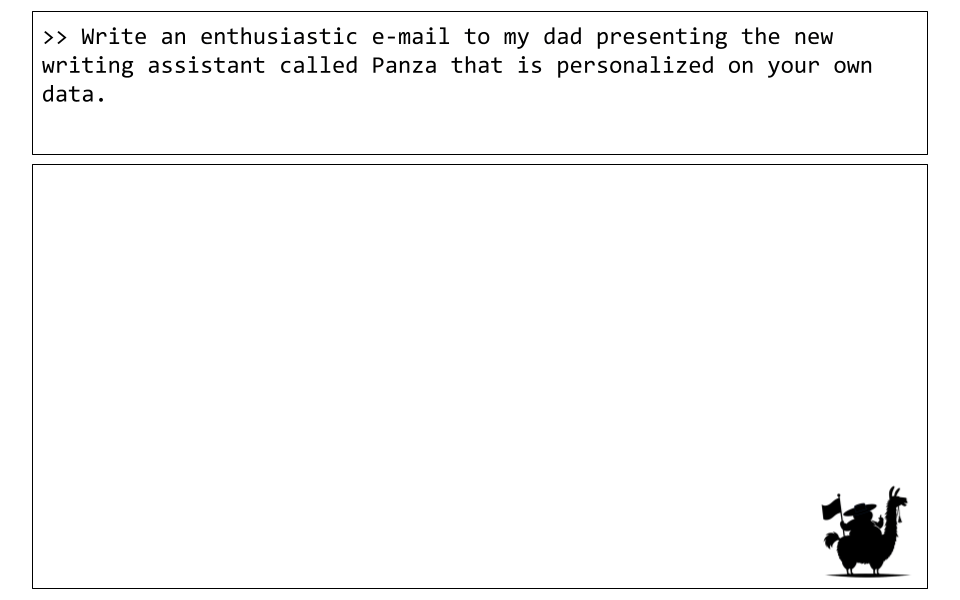

# Panza User Study

Hello there! Thank you for agreeing, and taking the time, to take part in this user study for our new tool, Panza: a personal email assistant, trained and running on-device. In this user study, we wish to perform some experiments that will evaluate 1) whether Panza can produce emails that are convincingly in your own voice, and 2) whether this tool would provide benefit to your daily email generation workflow (we refer to this as 'usefulness' in our work).  In order to evaluate this, we will ask you to download your personal emails from Gmail which will be used to fine-tune various model configurations. Once these models have been trained, you will be asked to score their outputs in specific settings. These ratings will then be used as part of our larger evaluation for our work. 

If you choose to take part in this user study, you are consenting to the following:
- Downloading your personal email data to fine-tune LLMs. This will be stored locally on your own machine provided you have access to a NVIDIA GPU, or it will be uploaded to remote server/cluster.
- Providing access to your model evaluations, whose prompts and responses may leak sensitive information (you are able to sanitise this). This will be visible to the experimenting team only, and not shared or used for any other purposes other than the evaluation itself.

Naturally, at any point, if you wish to withdraw your participation in this study, you simply need to email the organising team. Any information linked to your involvement in the study will be detailed, and will not be used for any further investigations.

Please read through all of the instructions before starting the user study. 

##  Context on the Proposed Application

### What is Panza?
Panza is an automated email assistant customized to your writing style and past email history. \
Its main features are as follows: 
* Panza produces a fine-tuned LLM that matches your writing style, pairing it with a Retrieval-Augmented Generation (RAG) component which helps it produce relevant emails.
* Panza **can be trained and run entirely locally**. Currently, it requires a single GPU with
16-24 GiB of memory. **At no point in training or execution is your data shared with the entities that trained the original LLMs, with LLM distribution services such as Huggingface, or with us.**
* Training and execution are also quick - for a dataset on the order of 1000 emails, training Panza takes well under an hour, and generating a new email takes a few seconds at most.

<div align="center">
  
</div>

## How does Panza work?

### :film_projector: Step 1: Data playback

For most email clients, it is possible to download a user's past emails in a machine-friendly .mbox format. For example, GMail allows you to do this via [Google Takeout](https://takeout.google.com), whereas Thunderbird allows one to do this via various plugins. 

One key part of Panza is a dataset-generation technique we call **data playback**:  Given some of your past emails in .mbox format, we automatically create a training set for Panza by using a pretrained LLM to summarize the emails in instruction form; each email becomes a `(synthetic instruction, real email)` pair.
Given a dataset consisting of all pairs, we use these pairs to "play back" your sent emails: the LLM receives only the instruction, and has to generate the "ground truth" email as a training target.

We find that this approach is very useful for the LLM to "learn" the user's writing style.


### :weight_lifting: Step 2: Local Fine-Tuning via Robust Adaptation (RoSA)

We then use parameter-efficient finetuning to train the LLM on this dataset, locally. We found that we get the best results with the [RoSA method](https://arxiv.org/pdf/2401.04679.pdf), which combines low-rank (LoRA) and sparse finetuning. If parameter efficiency is not a concern, that is, you have a more powerful GPU, then regular, full-rank/full-parameter finetuning can also be used. We find that a moderate amount of further training strikes the right balance between matching the writer's style without memorizing irrelevant details in past emails.


### :owl:	Step 3: Serving via RAG

Once we have a custom user model, Panza can be run locally together with a Retrieval-Augmented Generation (RAG) module. Specifically, this functionality stores past emails in a database and provides a few relevant emails as context for each new query. This allows Panza to better insert specific details, such as a writer's contact information or frequently used Zoom links.

The overall structure of Panza is as follows: 
<div align="center">
  
</div>


## Prerequisites to complete the user study.
In order to successfully take part in this user study, you will need access to the following: 

- Your emails, exported to `mbox` format from Gmail. (see tutorial below).
- Access to (likely a server) a machine, preferably with a 2xNVIDIA GPU with at least 48 GiB of memory. We have provided extra guidance on how to perform these steps best when using a remote server/cluster [here](#additional-guidance-how-to-setup-the-user-study-on-a-server).
- A Hugging Face [account](https://huggingface.co/login) to download the models (free of charge).
- [Optional] A Weights & Biases [account](https://wandb.ai/login) to log metrics during training (free of charge).
- Basic Python and Unix knowledge, such as building environments and running python scripts.
- *No prior LLMs experience is needed*.

## Setting Up The User Study Environment.
### Step 1: Cloning the repository
The first step to creating your user study environment is to download the following repository (https://github.com/IST-DASLab/PanzaMail) to the device where you are conducting the user study. **NB:** Please make sure that you change the directory from `main` to `human-eval` as this is where we have added all the neccessary instructions for this user study.

This can be done by executing the following command:
```
git fetch
git switch human-eval
```

### Step 2: Environment.
We tested Panza using python 3.10. If you are running a different version, you can either install it directly or, for instance, using [micromamba](https://mamba.readthedocs.io/en/latest/installation/micromamba-installation.html). We provide the instructions for installing this user environment below:
```bash
"${SHELL}" <(curl -L micro.mamba.pm/install.sh)
micromamba activate 
micromamba install python=3.10
```
You may also want to add `micromamba activate` to your `/.bashrc` script. Once this is done, please execute
```bash
micromamba create -n panza python=3.10 -y
micromamba activate panza
```
Then, Install the required packages:
``` bash
pip install .
```
In order to finetune models using Panza, you will need to install additional packages:
``` bash
pip install .[training]
```
**NB:** If this command does not work, please place the following parentheses: 
``` bash
pip install ".[training]"
```

## :rocket: Training your models on your personal data.

To quickly get started with building your own personalized email assistant, follow the steps bellow:

### Step 0: Download your sent emails
<!-- **Step 1: Download your sent emails** -->
<details>
  <summary> Expand for detailed download instructions.</summary>

  We provide a description for doing this for GMail via Google Takeout.

  1. Go to [https://takeout.google.com/](https://takeout.google.com/).
  2. Click `Deselect all`.
  3. Find `Mail` section (search for the phrase `Messages and attachments in your Gmail account in MBOX format`).
  4. Select it.
  5. Click on `All Mail data included` and deselect everything except `Sent`.
  6. Scroll to the bottom of the page and click `Next step`.
  7. Click on `Create export`.
  8. Wait for download link to arrive in your inbox.
  9. Download `Sent.mbox` and place it in the `data/` directory.

  For Outlook accounts, we suggest doing this via a Thunderbird plugin for exporting a subset of your email as an MBOX format, such as [this add-on](https://addons.thunderbird.net/en-us/thunderbird/addon/importexporttools-ng/).
</details>

At the end of this step you should have the downloaded emails placed inside `data/Sent.mbox`.


### Step 1: Environment configuration

<!-- 🎛️ -->
Panza is configured through a set of yaml configurations defined in `configs/`. There is a single high-level config under `configs/base.yaml`, and the rest are organized under the main functionalities of the code.
Note that these task-specific configs can, in some cases, be used to override base configs.
 Specific use cases, such as hyperparameter tuning, are covered in more detail in `scripts/README.md`.

1. Data preparation: `configs/data_preparation.yaml`. Additionally, a custom user config must be created under `config/users/` (see below).
1. Finetuning: the main config is in `configs/panza_finetuning.yaml` and the method-specific ones are in `configs/finetuning/`
1. Serving: Serving consists of two parts - a serving infrastructure (that we call 'writer') that runs the LLM and so converts prompts to Panza outputs, and an `interface`, which presents the outputs in a useful form - through a command-line interface, a web interface, a gmail client, or in a bulk `.json` format (useful for evaluation). The configs for serving are in `panza_writer.yaml`, and for the interfaces, under `configs/interfaces`.

<!-- 💬 -->
These scripts are described in more detail in `scripts/README.md`, but a few customizations need to happen immediately.
:warning: Before continuing, make sure you complete the following setup:
- Perform the following modifications on `users/default.yaml` directly. If running Panza for multiple users, copy this file to, for example, `users/jen.yaml` and specify the user in Panza training commands.
- In the user config, set the email address and username. The email address should be the sender address in the exported emails. (Panza uses this to edit out responses and other emails sent by a different author in the `.mbox` dump.). The username does not have to link to the email itself - it is simply used as a name for the various data files that will come out of the data preparation process. A handy way to set this is if you set it to be the output of the `whoami` call in your shell.
- Modify the personal prompt in `prompt_preambles/user_preamble.txt` to include some basic information about yourself that Panza can use to customize your emails with your correct full name, address, phone number, etc.
  

Additionally, please perform the following login steps to be able to download the base model. 
  - Login to Hugging Face to be able to download pretrained models: `huggingface-cli login`.
  - [Optional] Login to Weights & Biases to log metrics during training: `wandb login`. Then, set `wandb_disabled=false` in `configs/finetuning/base.yaml`.


You are now ready to move to `scripts`.
``` bash
cd scripts
```

### Step 2: Extract emails
<!-- **Step 2: Extract emails** -->

Run `CUDA_VISIBLE_DEVICES=X ./prepare_data.sh`.<details>
    <summary> This scripts takes care of all the prerequisites before training (expand for details). </summary>

    - Extracts your emails in text format to `data/<username>_clean.jsonl` which you can manually inspect.
    - Creates synthetic prompts for your emails as described in the [data playback](#film_projector-step-1-data-playback) section. The results are stored in `data/<username>_clean_summarized.jsonl` and you can inspect the `"summary"` field.
    - Splits data into training and test subsets. See `data/train.jsonl` and `data/test.jsonl`.
    - Creates a vector database from the embeddings of the training emails which will later be used for *Retrieval-Augmented Generation (RAG)*. See `data/<username>.pkl` and `data/<username>.faiss`.
</details>

**NB**: if you did not change the default configuration in `user/default.yaml` to reflect your particulars but rather created a new file, you need to add the additional flag to the above command where you specify `user=x` where your config file was named `x.yaml`.

<details>
    <summary> FAQs. </summary>
    When running the above script, you may encounter an <code>OutOfMemoryError</code>. If this is the case, you can either:
    <ol>
      <li> Reduce the batch size for the data processing step. This can be found in <code>configs/panza_preparation.yaml</code>.
      <li> Move to a machine that has more memory.
    </ol>
  </details>

When you have finished preprocessing your emails, you will find your emails contained in two separate `json` files: `train.json` and `test.json`. At this point you will likely want to sanitise these emails (i.e. removing emails that contain sensitive data that you do not wish to appear) - this can be done by removing the corresponding row from the relevant file. Additionally, please make sure that you do not have *millions* of training examples; this will slow the traning speed significantly as there will simply be more examples to process. Based on our experimental evidence, we recommend having between 128 and 1000 sent emails as training targets. Less than 128 might cause the model to overfit, while we haven't found that more than 1000 emails help for the style transfer.

### Step 3: Train a LLM on your emails
<!-- **Step 3: Train a LLM on your emails** -->

In these experiments, you will be fine-tuning a `Llama-3-8B` base model. These will be based on default hyperparameter settings that we have found to bring about the best performance experimentally. This fine-tuning procedure will be enhanced by a RAG component, which retrieves query-related emails to  provides additional conext to the LLM at train.

Before we begin, we need to ensure that the following two settings:
1. In `configs/writer/prompting/email_prompting.yaml`, please set `rag_prob:0.55`.
1. In the same file, please set `number_rag_emails` and `number_thread_emails` to `2`.

#### Step 3.1: Fine-tuning with RoSA
For parameter efficient fine-tuning, run `./train_rosa.sh`

#### Step 3.2: Full Fune-tuning
In order to perform fine-tuning is possible, run `./train_fft.sh`. 

**NB:** It is likely that you will need to have access to more than one GPU to support the memory requirements of the FFT of Llama-3-8B. If you do not have access to this, please consider using a server cluster.

<details>
    <summary> FAQs. </summary>
    The bash scripts that are used to execute the finetuning procedure assume by default that your username is what is returned by the <code>whoami</code> command. This is used to locate the name of the user configs inside the <code>configs/user</code> directory as above. If you directly modified <code>default.yaml</code>, or created another yaml file where the name of that file does not match with the output of <code>whoami</code>, there will be an error. This is an easy fix. You can either:
    <ol>
      <li> Change the name of the yaml file to be the output of <code>whoami</code>.
      <li> You can override the username manually when you launch the bash script by adding <code>user=x</code> where <code>x</code> is the name of the yaml file you created. For example: <code>./train_rosa.sh user=alonso</code>
    </ol>
  <br>
  If you wish to add <code>CUDA_VISIBLE_DEVICES</code> to specify a specific GPU, please add this in the shell script directly by <code>export CUDA_VISIBLE_DEVICES=x</code> where <code>x</code> is the ID of the GPU you wish to use.
  <br><br>
  A known issue is that when you fine-tune your model with RAG, there can be a case when the tokenization of the dataset seemingly hangs. This is due to a known bug with with HF's <code>map</code> function where <code>n_proc>1</code>. To alleviate this issue, you can set <code>torch.set_num_threads(1)</code> in <code>src/panza/finetuning/train.py</code> or set the equivalent parameter in <code>configs/finetuning/rosa.yaml</code>.
  </details>

Once the training processes have completed, you will find the two models in the `checkpoints/models/[name of experiment]` directory.

## :open_book: Conducting the user study - Usefulness.
Provided that you have produced your two FFT and RoSA models, we are ready to begin with the evaluation of the usefulness of Panza. In this section, we will be conducting two types of evaluations. In both cases, you will be asked to evaluate Panza's generation quality for usefulness across 16 prompt/Panza response pairs. The first experiment will generate responses to 16 hand-constructed prompts, where as the second experiment will generate responses to 16 randomly selected prompts from the user's held-out set. In addition to the fine-tuned models, you will evaluate the performance of a Llama3-8B-Instruct checkpoint for consistancy.

Before we begin, we need to ensure that the following settings:
1. In `configs/writer/prompting/email_prompting.yaml`, please set `rag_prob:1.0`.
1. In the same file, please set `number_rag_emails` and `number_thread_emails` to `3`.
1. In `configs/interfaces/human_eval.yaml`, `path_to_fixed_prompt` is `"data/fixed_prompts.txt"` and `mode` is `"rating"`.

### How does the experiment work?
For each experiment, you will be asked to to execute a certain script that will perform the model's inference step according to the respective prompt class. The resulting prompts and responses are outputted in the form of a `.csv` file at `human_eval` directory. Once generated, we recommend that this data is uploaded into Google sheets for ease of use (we advise making the cells larger and wrapping the text (format -> wrapping -> wrap)). Once this has been completed, please rate the email outputs. The rating scale is as follows. Please use your own best judgment for what exactly minor/nontrivial changes mean to you:
```
3: Very useful: would send as-is or with minor changes

2: Moderately useful: would sent only after nontrivial changes

1: Not useful: needs a complete rewrite
```
Once this has been completed, please sanitise and anonymise the prompts and Panza response for any sensitive information which is to be submitted at the end of the user study.

### Experiment 1: Fixed Prompts

#### FFT Model
In order to run the fixed prompt model evaluation with the FFT model, please execute (**NB:** ensure that `eval_type` in `configs/interfaces/human_eval.yaml` is set to `fixed`.):
```
./runner.sh interfaces=human_eval writer/llm=transformers checkpoint=[path_to_fft_folder]
```
**NB:** The model folders are contained in `checkpoints/models`.
#### RoSA Model
In order to run the fixed prompt model evaluation with the RoSA model, please execute:
```
./runner.sh interfaces=human_eval writer/llm=peft checkpoint=[path_to_rosa_folder]
```

#### Llama-3-8B Model
In order to run the fixed prompt model evaluation with the Llama-3-8B model, please execute:
```
./runner.sh interfaces=human_eval writer/llm=transformers checkpoint=ISTA-DASLab/Meta-Llama-3-8B-Instruct
```

### Experiment 2: User-Generated Prompts

#### FFT Model
In order to run the user-generated prompt model evaluation with the FFT model, please execute (**NB:** ensure that `eval_type` in `configs/interfaces/human_eval.yaml` is set to `own`.):
```
./runner.sh interfaces=human_eval writer/llm=transformers checkpoint=[path_to_fft_folder]
```

#### RoSA Model
In order to run the user-generated prompt model evaluation with the RoSA model, please execute:
```
./runner.sh interfaces=human_eval writer/llm=peft checkpoint=[path_to_rosa_folder]
```

#### Llama-3-8B Model
In order to run the user-generated prompt model evaluation with the Llama-3-8B model, please execute:

```
./runner.sh interfaces=human_eval writer/llm=transformers checkpoint=ISTA-DASLab/Meta-Llama-3-8B-Instruct
```
### Completing the Rating
Once you have generated all of the `.csv` files, you are ready to export them to Google Sheets to preform the rating task. Please ensure that the prompts for each of the model outputs in each task category are the same. Additionaly, please save all of your ratings in one excel spreadsheet, where each sheet is a separate task. Once this has been completed, please anonymise and sanitise your outputs for any sensitive information that you do not wish to be shared, and share a link to the sheet with the organising team.

## :open_book: Conducting the persona recognition study.
Provided that you have produced your RoSA models as specified by the instructions above, we are ready to begin with how well Panza can adapt to the unique voice of the emails, and thus of the author. Specifically, for a given prompt, you will be given four candidate responses: two from real individuals who are familiar with one another, one from an individual not known by the participant and an untrained Llama-3-8B model. Your task will be to indentify which response belongs to which *author*; this will be repeated for a selection of 24 custom prompts.

To create the necessary information for this study, we will ask you to perform inference with your local model on the set of the 24 custom prompts. Once this is done, you will be asked to send the output `csv` file as is to the experiment organisers *without* looking at the model outputs. This decision is made by design (you cannot see your own emails as you will be asked identify them). The prompts are designed such that they will likely not generate any sensitive content. In the case that this occurs, the experimenting team will clean this for you.

### Pre-experiment Setup
In order to perform the inference needed, we need to adjust some of the configuration files. In `configs/interfaces/human_eval.yaml`, please change the following configurations:
1. `eval_type` to `"fixed"`
1. `mode` to `"inference"`
1. `path_to_fixed_prompt` `"data/custom_prompts.txt"`
1. Please also alter your `prompt_preambles/user_preambles.txt` text to be: "My name is John Smith". This is to ensure that across all participants in the study, we are using the same personal information at inference, thus preventing an arbitrary signal for personal identification. **NB:** Please store/remember what your original prompt preable was; you will need this in the next set of experiments.

Additionally, for the sake of neatness, please move the previous `.csv` files into a seperate subsirectory (e.g. `usefulness/`).

### Running the inference step
In order to generate the output need for this experiment, please execute the following command:
```
./runner.sh interfaces=human_eval writer/llm=peft checkpoint=[path_to_rosa_folder]
```
Once this step has been completed, please send the output `.csv` file to the organising team and await further instruction to perform the rating task.

## :open_book: Conducting the impersonation study.
The final user study that we will ask you to perform is our impersonation study. We posit that while Panza can be used to improve email generation productivity, it can also be used for nefarious means. Specifically, an adversary, with access to your email history (through a data leak, or perhaps by scraping content from social media), can train an Panza model to impersionate your voice. The adversary can then use this agent to request sensitive information from people connceted to you given that can convincingly produce content that is very similar to what you would have written yourself.

In this user study, we attempt to answer: i) whether this is indeed the case, and ii) how many emails are needed to do this convincingly. The user study is structured as follows:
1. From the user's held-out test set (i.e 20% of all emails), we randomly sample a selection of $N$ prompts. We will set $N=20$ for our purposes.
2. Based on draws from a random probability distribution, we will divide the data into four groups to generate responses (**NB:** There emails are not partitioned equally into the four groups, and there is no predefined order in which they will be presented).
    1. Group 1: The responses for this group of emails will simply be the actual gold responses written by that individual.
    1. Group 2: The responses of this group of emails will be the outputs of a high-volume Panza model.
    1. Group 3: The responses of this group of emails will be the outputs of an untrained Llama-3-8B model.
    1. Group 4: The responses of this group of emails will be the outputs of a low-volume Panza model.
1. Once the inference procedure has been performed, you will be given a chance to sanitise and anonymise the prompts/outputs to remove any information you do not want to be shared.
1. Once the final outputs have been determined, the `.csv` file containing these responses will be sent to a collague of yours who has familiarity with your writing style. They will then be asked to rate each of the prompt/response pairs on the following scale (please write the corresponding number and not the words):
    1. Suspicious: likely written by a bot or a stranger (indicated by a label of 1)
    1. Credible: the email sounds like something XXX would have written, where XXX is the participant (indicated by a label of 0).
1. Finally, we will evaluate the emails per response group to determine how (un)convincing they were.

### Pre-Experiment Setup: High Volume Model
To complete this study, we once again need to change a few configurations. Namely:
1. In `configs/interfaces/human_eval.yaml`, please change the following configurations:
    1. `eval_type` to `"impersonation"`
    1. `mode` to `"rating"`
1. In `configs/writer/prompting/email_prompting.yaml` please edit `number_thread_emails` and `number_rag_emails` to be `0`.
1. Please revert the `prompt_preambles/user_preamble.txt` to what you had used originally (i.e. your personal user prompt).

As before, for the sake of neatness, please move the previous `.csv` files into a seperate subsirectory (e.g. `persona_recognition/`).

### Part 1: Generating High Volume Model and Llama Responses
To execute the inference portion of the study, please execute the following commands:
```
./runner.sh interfaces=human_eval writer/llm=peft checkpoint=[path_to_rosa_folder]
./runner.sh interfaces=human_eval writer/llm=transformers checkpoint=ISTA-DASLab/Meta-Llama-3-8B-Instruct
```
### Part 2: Low Volume Model Responses
This experiment has a little bit more setup than previous user studies. We want to examine whether the impersonation capabilities of Panza transfer to a *low-data* regime, namely where you have access to only $75$ emails from your history. 

To begin this process, please do the following steps:
1. To create your $75$ email dataset, please go to the data directory (i.e `cd ../data` in you are in `scripts`) and execute: `shuf -n 75 train.jsonl > train_75.jsonl`.
1. Once this is done, please change the `train_loader.data_files` field to be `${user.data_dir}/train_75.jsonl` in `configs/finetuning/base.yaml`.
1. Becuase of this change, we need to train the model for a few more epochs. Please change `max_duration` in `configs/finetuning/rosa.yaml` to be `11ep`
1. As in the previous experiment, please ensure that your `prompt_preambles/user_preamble.txt` text is the one that you have personally created, and not "My name is John Smith".

Once this has been done, we need to reain a new RoSA model. Please `cd ../scrips` and execute:
```
./train_rosa.sh
```
This will create a new low-data regime model. The output name is very similar to the previous model except the duration for which it was trained. Please look out for this when copying the model name for inference.

Now we are ready to complete the inference step with the low-data regime model.

```
./runner.sh interfaces=human_eval writer/llm=peft checkpoint=[path_to_rosa_folder]
```
This will generate the relevant `.csv` file in the `human_eval` directory. Please sanitise the output, and send over the file to the experiment organisers. Please await further instruction.

## Additional Guidance: How to setup the user study on a server?
In the case that you do not have access to a NVIDIA GPU locally (but rather on a cluster), we are able to provide additional support to assist you through this process. All that will differ from doing this on a local NVIDIA GPU is that you will upload your emails to the remote server.

This guidance is designed to compliment the initial user study workflow. Please follow the initial guidance, substituting the relevant steps for the remote server access.

### Step 1: Transferring your email data to the remote server
In [this section](#step-0-download-your-sent-emails), you are required to download your emails in `.mbox` format, and place these within the `data` directory. If you do not wish to send over the entire file, please follow the steps below.

When you execute the `./prepare_data.sh` script, the first step of this process is to extract the emails from `.mbox` format so that they are readily availble as text within a larger `json` structure. In particular, this involves additional preprocessing steps such as: removing forwarded emails, emials with attachments and emails that are not written in English. The result of this process is a file titled `[username_goes_here]_clean.jsonl`, which contains all the emails that can be used further in the Panza process. 

Instead of uploading the entire  `Sent.mbox` file, you can instead preform `./prepare_data.sh` on your local machine (this has been tried on an M-Series Mac and has worked successfully) to generate the cleaned data json file. Specifically, prior to executing the data preparation script, please update the `pause_at_extract` field in `configs/panza_preparation.yaml` to be `true`. Then you are able to execute the `./prepare_data.sh` script. You will see the resulting file in the `data` directory. This also gives you an oppertunity to manually remove entries from this `...clean.jsonl` file in the case that you find emails that you do not wish to be included in the Panza process.

To preform the experiments on the remote server, you will need to upload this `.mbox` file (or the cleaned json). This can be done using the `scp` tool. Please find additional guidance [here](https://linuxize.com/post/how-to-use-scp-command-to-securely-transfer-files/) on how to use it.

### Step 2: Memory needed.
To support the training of Llama-3-8B, we require access to 1xGPU with 48 GB of memory to train the Llama-3-8B model using RoSA. Unfortunately, there is not enough memory to support full fine-tuning using one GPU. To support this use case, FFT requires two 2xGPU, each with 48 GB of memory.

